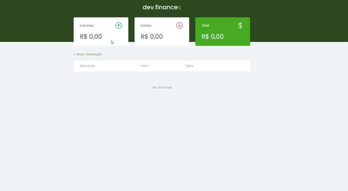

<h5 align="center">
  
</h5>

<h1 align="center"> :desktop_computer: Demonstração </h1>

***
### :mag: Sobre  
O dev.finances foi desenvolvido durante a maratona Discover da Rocketseat e é uma aplicação de controle financeiro, onde é possível cadastrar e excluir transações e ver o saldo de entrada e saída 💰
***
### :hammer_and_wrench: Ferramentas Utilizadas  
- 
- 
- 
